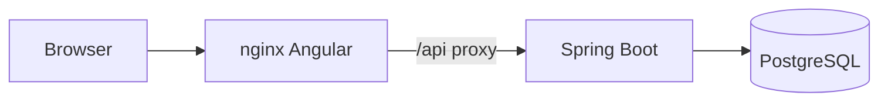

# ACME Employee Salary Management

Local HR system for searching, updating, and analyzing compensation records for ~10,000 ACME employees without spreadsheet sprawl.

## Context

- Version: 1.0.0
- Stack: Java 21, Spring Boot 3.3, PostgreSQL 16, Angular 20, Docker Compose

## Prerequisites

- Docker Desktop 4+ (Compose v2)
- Optional local tooling: JDK 21, Maven 3.9+, Node.js 20+

## Quick Start

```bash
cp .env.example .env
docker compose up --build
```

Open http://localhost:9080 and sign in with credentials from `.env` (`SEED_HR_EMAIL` / `SEED_HR_PASSWORD`).

API health: http://localhost:8081/api/v1/health

## Architecture



Layers (DDD): Presentation → Application → Domain → Infrastructure.

## Configuration

Copy `.env.example` to `.env`. Do not commit secrets. Key variables:

- `DB_PASSWORD` — PostgreSQL password
- `JWT_SECRET` — HS256 signing secret (min 32 chars)
- `SEED_ON_START` — set by Compose to seed 10k employees
- `SEED_HR_EMAIL` / `SEED_HR_PASSWORD` — demo HR login

## Local UI (optional)

With the API already running on port 8081:

```bash
cd frontend && npm install && npm start
```

Open http://localhost:4200. `proxy.conf.json` forwards `/api` to `http://127.0.0.1:8081`.

## Common Issues

- Port 9080 or 8081 already bound: stop the conflicting process or change ports in `docker-compose.yml`.
- First boot is slow while Maven/npm build and seed run; wait until API logs show seed completion.
- Login fails after rebuild with a fresh volume: confirm `.env` password matches the seeded user.
- If something else already uses host port 8080, this Compose stack serves the UI on **9080**.
- Local `ng serve` login 404 on `/api/...`: ensure the API is on 8081 and restart `npm start` so `proxy.conf.json` is loaded.

## Smoke check

```bash
./scripts/smoke.sh
```


Sample Screens

Login Screen 


Employee List 


Add Employee Screen with validation 


Save Employee 


Add Salary Range


Mark employee as IN-Active 


IN-ACTIVE Employee screen where salary addition is not allowed 


Re-Active employee screen 


Analytics Dashboard by currency , country & department


Salary Distribution bands 


