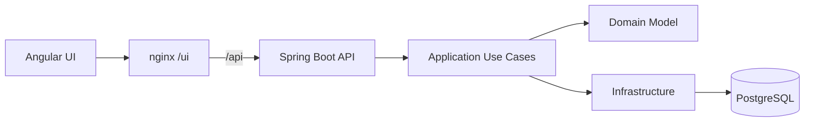
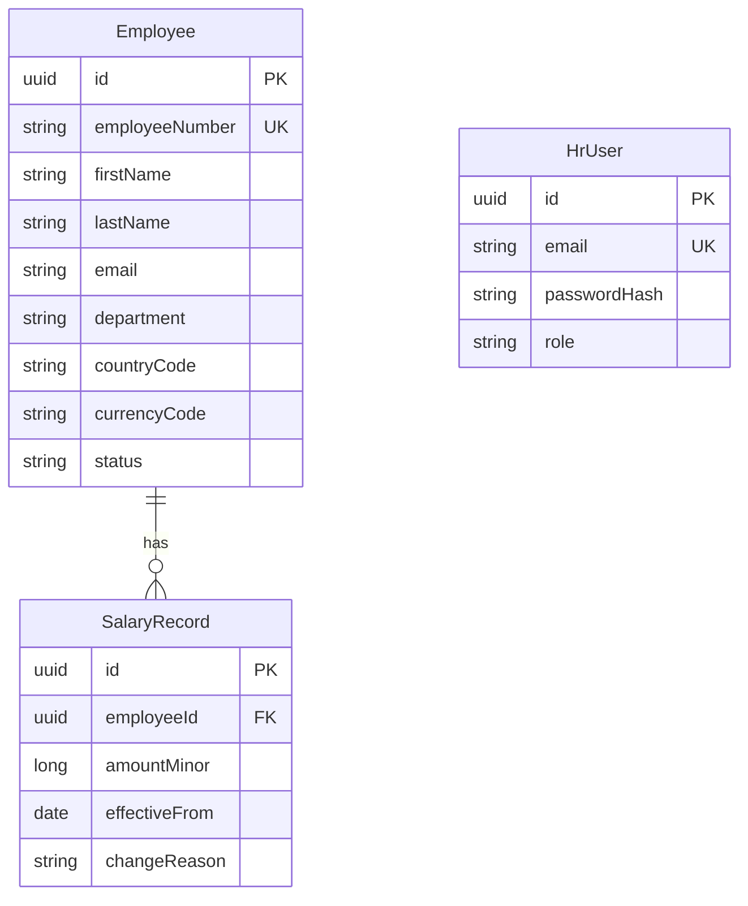

# Architecture

## Overview

Modular monolith with Domain-Driven Design. Dependencies point inward: Presentation → Application → Domain ← Infrastructure.

## Bounded Context

**Compensation** — employees, salary records, and org analytics. Single ACME organization; no tenancy.

## Layer Responsibilities

| Layer | Package | Responsibility |
|-------|---------|----------------|
| Presentation | `presentation` | REST controllers, request/response DTOs, Bean Validation, JWT filter, security headers, CORS |
| Application | `application` | Use-case services (auth, employee, analytics); orchestration only |
| Domain | `domain` | Entities, value objects (`Money`, `CountryCode`), domain rules |
| Infrastructure | `infrastructure` | JPA entities/repos, Flyway, seed runner, JWT provider, logging config |

## Domain Model

Current salary is derived as the `SalaryRecord` with the latest `effectiveFrom` for an employee.

## API Surface

| Method | Path | Purpose |
|--------|------|---------|
| POST | `/api/v1/auth/login` | HR demo login → JWT |
| GET | `/api/v1/employees` | Paginated list + filters |
| GET | `/api/v1/employees/{id}` | Detail + salary history |
| POST | `/api/v1/employees` | Create employee + initial salary |
| PUT | `/api/v1/employees/{id}` | Update demographics |
| POST | `/api/v1/employees/{id}/salaries` | Add salary change |
| GET | `/api/v1/analytics/summary` | Headcount, totals/averages, by country/dept |
| GET | `/api/v1/analytics/distribution` | Salary bands for charts |
| GET | `/api/v1/health` | Readiness |

## Security

- **AuthN:** JWT (HS256), secret from environment
- **AuthZ:** Role `HR_MANAGER` for all mutating and read endpoints (except health and login)
- **CORS:** Explicit origins only (`http://localhost:8080`, `http://localhost:4200`)
- **Headers:** CSP `default-src 'self'`, `X-Content-Type-Options: nosniff`, HSTS when TLS is enabled
- **Trust boundary:** Browser → Angular/nginx → Spring API → PostgreSQL

## Deployment

Docker Compose services: `postgres` (healthchecked volume), `api` (waits on DB, migrates, optional seed), `ui` (nginx static Angular build, proxies `/api` to api).
 